import { Aside } from '@astrojs/starlight/components';

Die Bedieungsanleitung von Kontoflow. 

## Kontoflow starten

Die Anwendung lässt sich mit einem Doppelklick auf die Verknüpfung starten. 
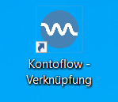

Es öffnet sich daraufhin der Startbildschirm. 

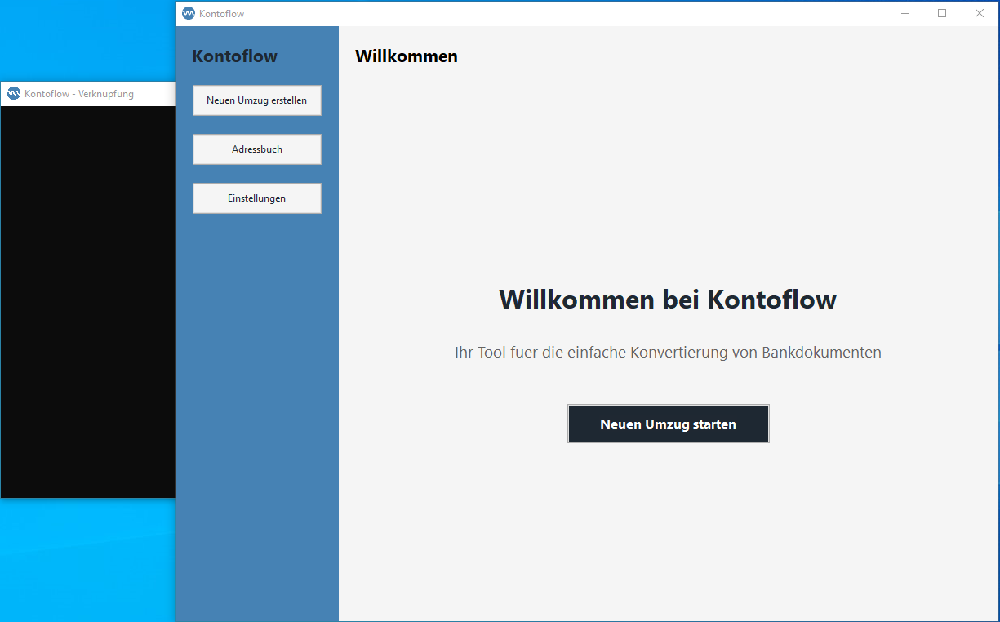

<Aside>Neben der Anwendung startet auch ein CMD-Fenster, welches jedoch einfach ignoriert werden kann. Siehe auch [Bekannte Probleme](bekannteprobleme). </Aside>

## Übersicht der Funktionen

### Neuen Umzug erstellen

Ein Kontoumzug erfolgt in meheren Schritten und wir durch einen Wizard unterstützt. Die Schritte können mit `Weiter` und `Zurück` gewechselt werden. Gestartet wird der Wizard mit dem Knopf `Neuen Umzug erstellen` in der Sidebar, oder mit dem Knopf `Neuen Umzug starten` auf dem Startbildschirm. 

#### 1. Kontowechselhilfe PDF-Datei auswählen

Im ersten Schritt wird die zu lesende Kontowechselhilfe ausgewählt. Mit einem Druck auf `Dokumente hinzufuegen` öffnet sich ein Datei-Dialog und eine PDF-Datei kann ausgewählt werden. 
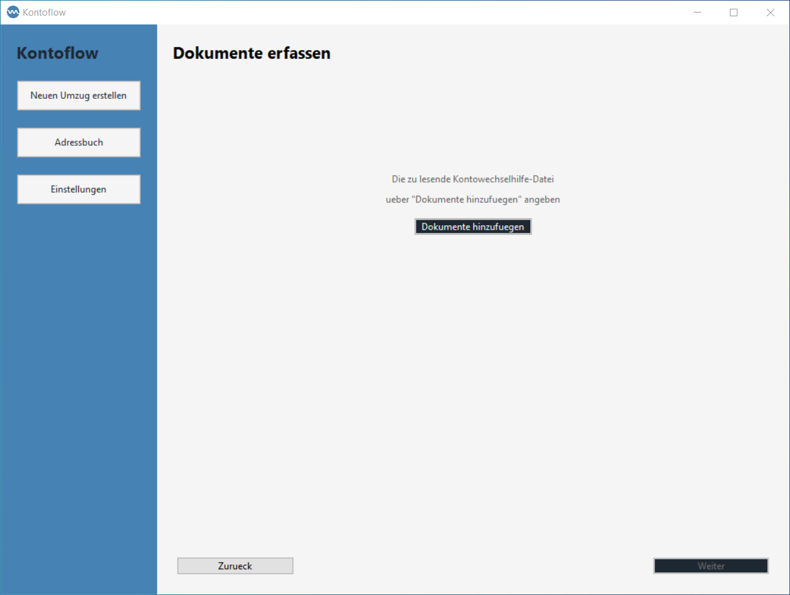

#### 2. Ausgangs-Bank wählen

Im zweiten Schritt wird ausgewählt, welche Bank die Kontowechselhilfe erstellt hat. Zudem kann aktiviert werden, ob neben der PDF Ausgabe Debug-Dateien erzeugt werden sollen. 
Ist die Option aktiv, werden die Debug-Dateien im Unterordner `debug` vom Installationsordner von Kontoflow abgelegt. Mit jedem neuen Umzug werden die vorherigen Debug-Dateien überschrieben. 

<Aside type="caution">Die Debug-Dateien enthalten sensible personenbezogene Daten des jeweiligen Umzugskunden, die Weitergabe der Debug-Dateien ist daher nicht unbedenklich. Siehe auch [Debuggen](debug). </Aside>

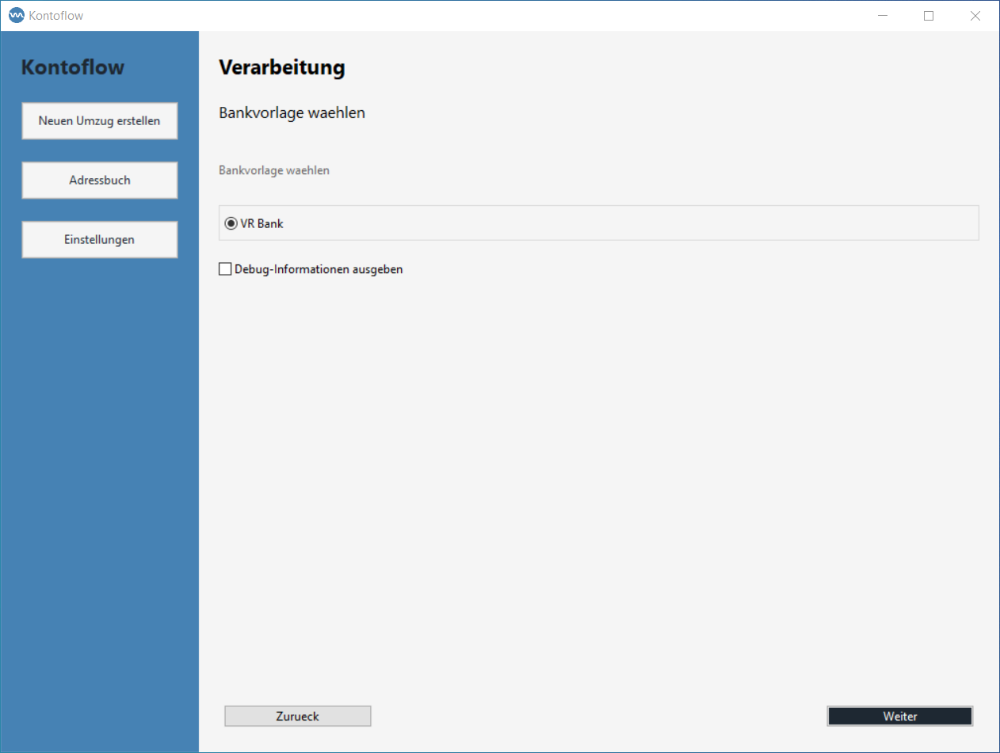

#### 3. Ausgabeornder wählen

Im dritten Schritt kann ein Ordner ausgewählt werden, an dem die jeweiligen PDFs für die Gläubiger des Umzugs abgespeichert werden sollen. 

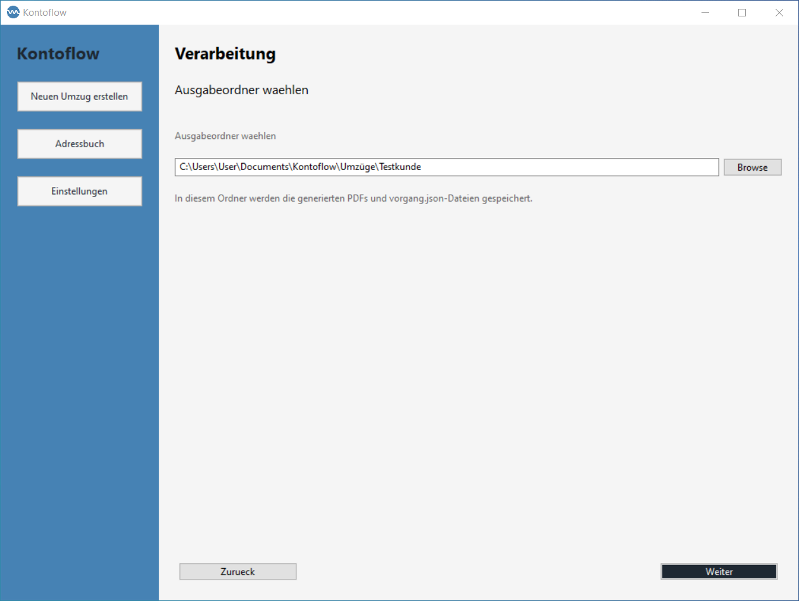

#### 4. Absender angeben

In der Kontowechselhilfe stehen nicht alle Stammdaten des Kundens, daher können die fehlende Information im Schritt vier eingegeben werden. 
Nach dem eingeben der Informationen kann die Verarbeitung der PDF Dateien gestartet werden. 

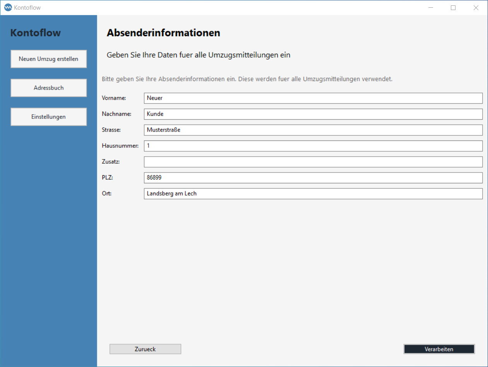

##### 5. Verarbeitung

Im fünften Schritt startet die eigentliche Verarbeitung der Daten. 
<Aside>Derzeit friert die Anwendung ein, während die PDF Dateien verarbeitet werden. Dennoch wird im Hintergrund der Prozess fortgesetzt. Nach Abschluss der Verarbeitung ist die Anwendung wieder responsive. Siehe auch [Bekannte Probleme](bekannteprobleme). </Aside>

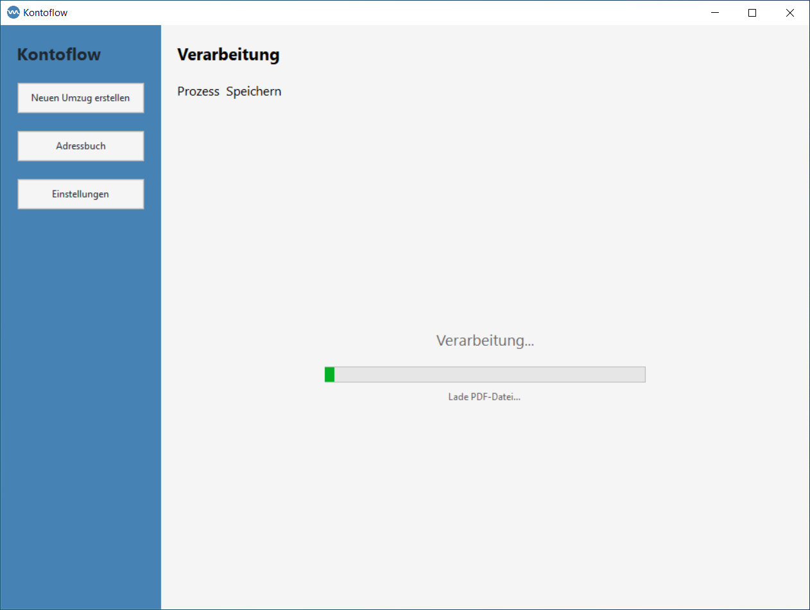

Falls in der Kontowechselhilfe Gläubiger vorhanden sind, welche noch nicht im Adressbuch angelegt sind, dann melden Kontoflow die fehlenden Gläubiger-IDs. Die Verarbeitung kann entweder unterbrochen und im Adressbuch direkt die Gläubiger hinzugefügt werden, oder weiter fortgesetz werden, in diesem Fall haben die PDFs für die fehlenden Gläubiger dann Beispieldaten im Empfängerfeld. 

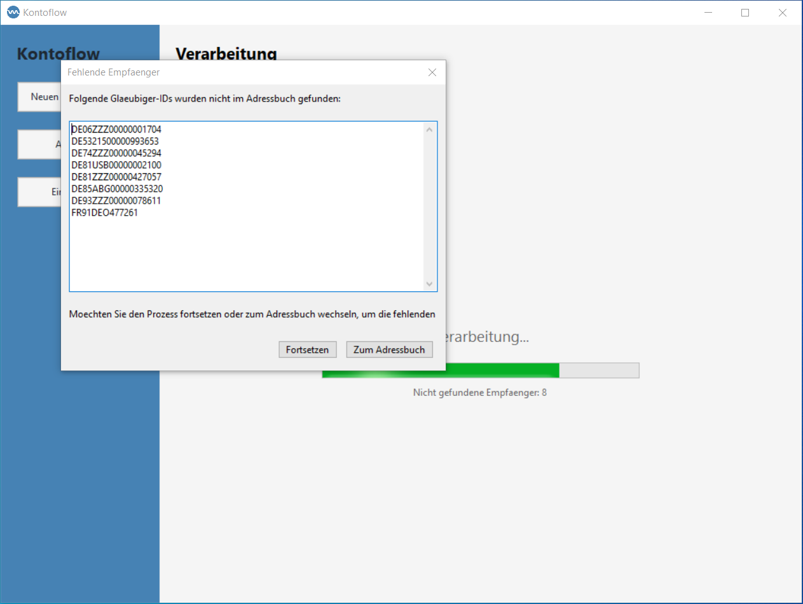

##### 6. Abschluss

Am Ende der Verarbeitung wird der Abschluss des Vorgangs gemeldet und es wird auf die Willkommens-Seite gewechselt. 
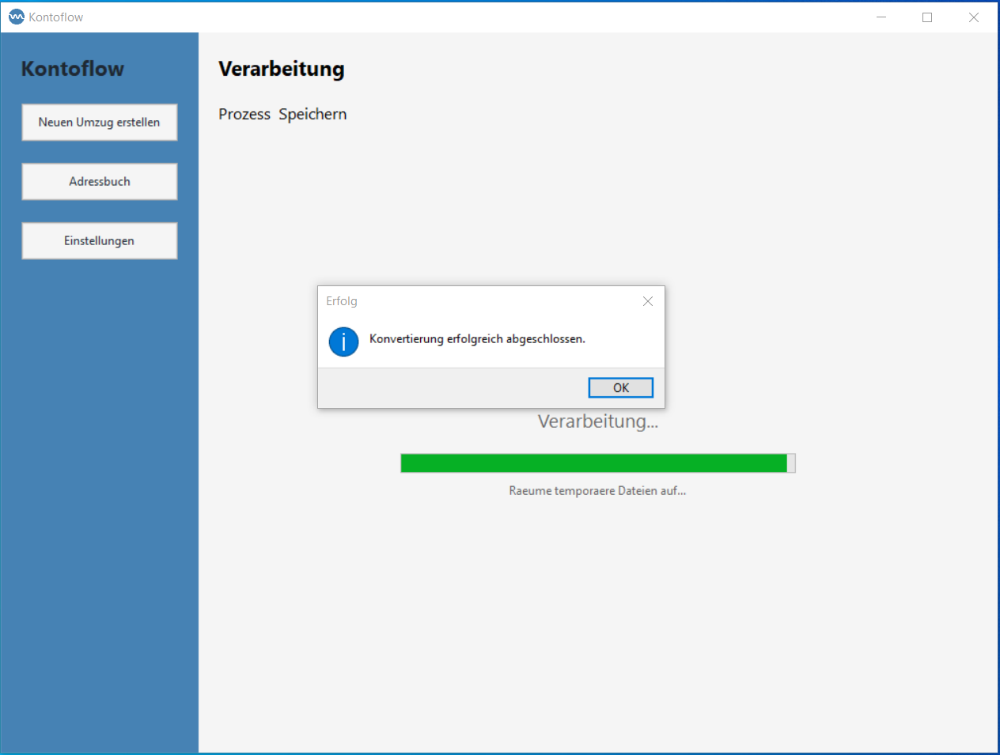

In dem zuvor angegebenen Ausgabeordner befinden sich nun mehere PDF Dateien. Für jeden gefundenen Gläubiger wird eine PDF Datei erstellt. 
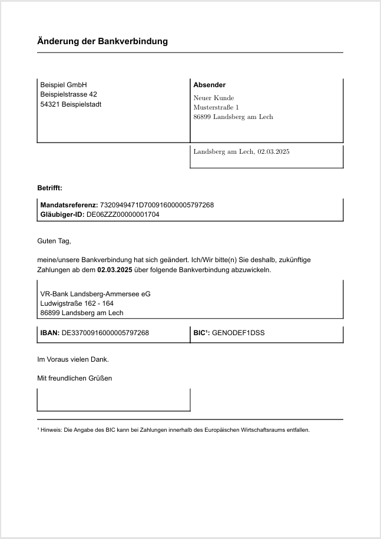

### Adressbuch

Im Adressbuch können die Gläuber erstellt, bearbeitet und gelöscht werden. 

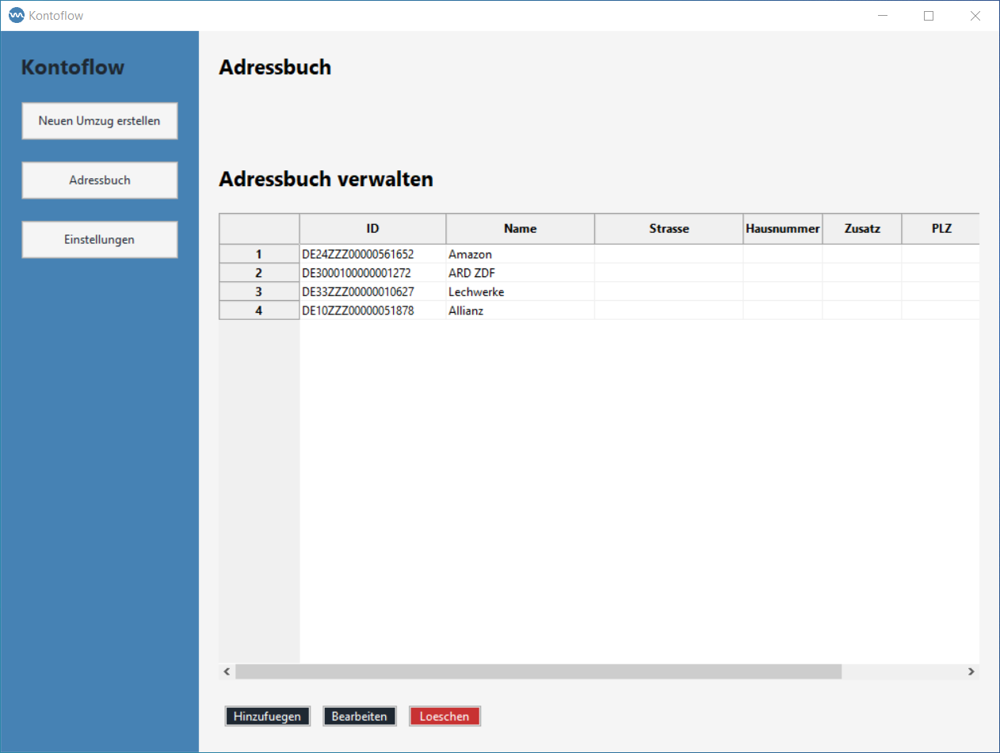

#### Erstellen

Mit den Knopf `Hinzufügen` öffnet sich eine Eingabemaske. Dort kann die Gläuber-ID in dem Feld ID eingetragen werden, sowie die notwendigen Stammdaten um den Gläuber zu adressieren. 

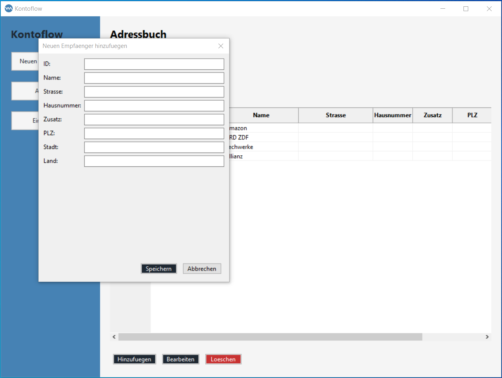

#### Bearbeiten

Um einen bestehenden Gläubiger anzupassen muss dieser mit einem Klick auf die passende Nr. in der ersten Spalte, zuerst ausgewählt werden, danach kann mit dem Knopf `Bearbeiten` die Daten des Gläubigers angepasst werden. 

#### Löschen

Um einen bestehenden Gläubiger zu löschen muss dieser mit einem Klick auf die passende Nr. in der ersten Spalte, zuerst ausgewählt werden, danach kann mit dem Knopf `Löschen` der Gläubiger gelöscht werden. 

### Einstellungen

In den Einstellungen können die Stammdaten der Ziel-Bank hinterlegt werden
Ebenso können Standard Ordnerpfade für das Lesen von Kontoumzugshilfen PDF-Dateien und das speichern der SEPA-Lastschrift-Änderungs PDF-Dateien angegeben werden. 

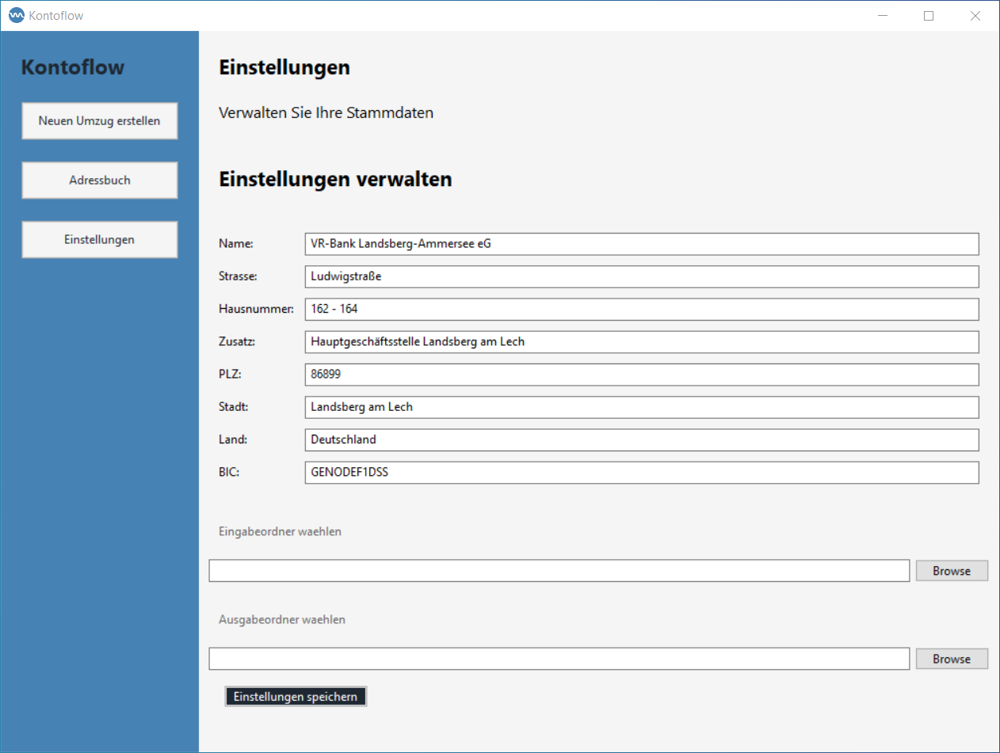