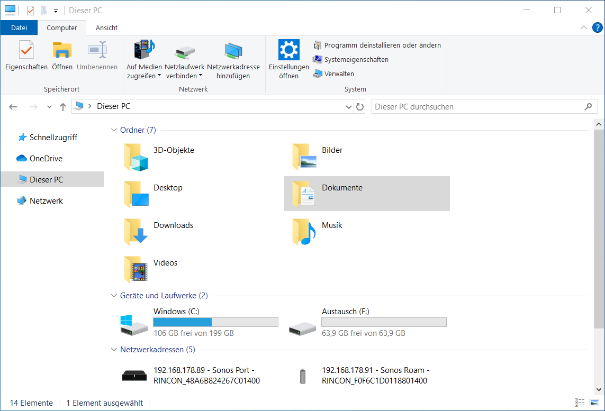
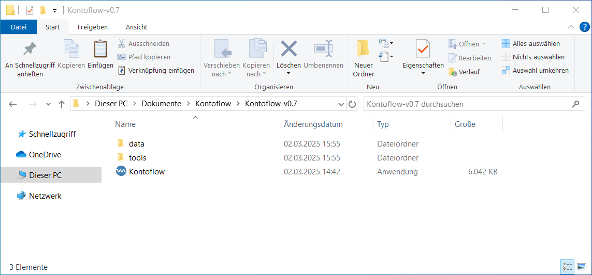
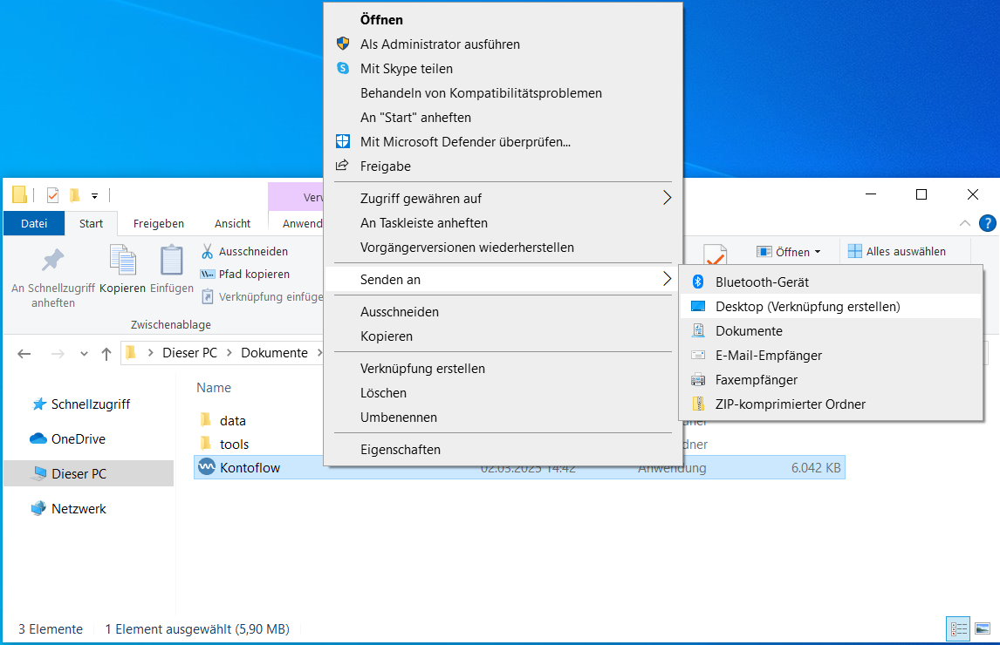

import { FileTree } from '@astrojs/starlight/components';

In der Beta von Kontoflow gibt es noch keinen Install Wizard, daher muss die Installation manuell vorgenommen werden.

## Kopieren der Anwendung auf den Computer

Jede Beta Version wird als .zip-Datei ausgeliefert. Diese Datei kann an einem beliebigen Ort auf dem Computer extrahiert werden. Beispielsweise eignet sich ein neuer Ordner `Kontoflow` im Dokumente-Ordner des angemeldeten Benutzers: `Dieser PC > Dokumente > Kontoflow`. 

Es ist möglich zwischen verschiedenen Versionen von Kontoflow einfach zu wechseln, indem für jede Version ein Ordner erstellt wird. 

Damit Kontoflow korrekt funktioniert muss die Ordner- und Dateistruktur wie folgend aufgebaut sein, bei dem extrahieren der .zip-Datei ist die Struktur bereits korrekt. 

<FileTree>

- data
  - debug/
  - template
    - umzug.typ
  - EmpfaengerLUT.json
  - logo.ico
  - settings.json
- tools
  - typst.exe
- Kontoflow.exe

</FileTree>

Für das einfachere Starten von Kontoflow empfiehlt es sich eine Verknüpfung, der Kontoflow.exe, auf dem Desktop anzulegen. 

Damit ist die Installation abgeschlossen. 

